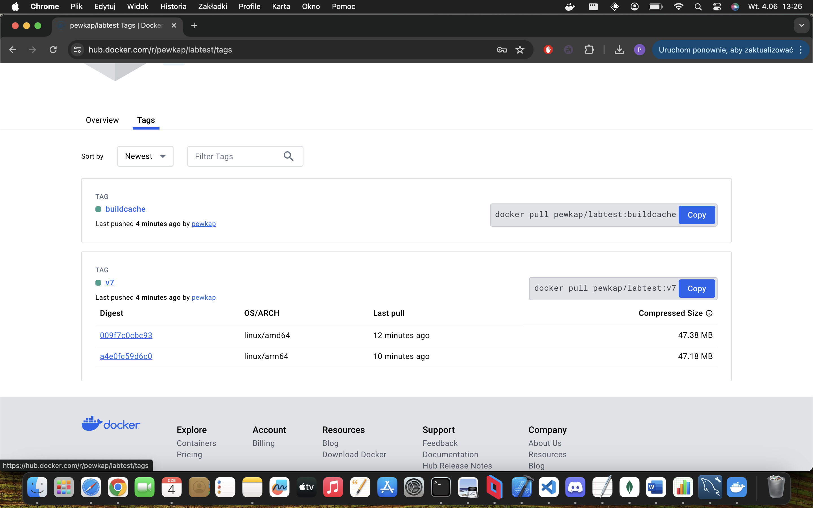

docker buildx imagetools inspect docker.io/pewkap/labtest:v7
Name:      docker.io/pewkap/labtest:v7
MediaType: application/vnd.oci.image.index.v1+json
Digest:    sha256:f61568a1335a47548916359588f93e7eed4684fc0e01ea21494d0a7999413c52
           
Manifests: 
  Name:        docker.io/pewkap/labtest:v7@sha256:009f7c0cbc93b2f270481c2c0290e3fa1a08c7fe6460b2c4c35df7176b7d3dbb
  MediaType:   application/vnd.oci.image.manifest.v1+json
  Platform:    linux/amd64
               
  Name:        docker.io/pewkap/labtest:v7@sha256:a4e0fc59d6c04c12676730cbdef1c46d96c7c9de034ddca0724fcc30f58cb9d7
  MediaType:   application/vnd.oci.image.manifest.v1+json
  Platform:    linux/arm64
               
  Name:        docker.io/pewkap/labtest:v7@sha256:e6b2c7dd93b5f8fbed32770d9d3b112aafd6365327580df9f47d34598deb8de7
  MediaType:   application/vnd.oci.image.manifest.v1+json
  Platform:    unknown/unknown
  Annotations: 
    vnd.docker.reference.digest: sha256:009f7c0cbc93b2f270481c2c0290e3fa1a08c7fe6460b2c4c35df7176b7d3dbb
    vnd.docker.reference.type:   attestation-manifest
               
  Name:        docker.io/pewkap/labtest:v7@sha256:87373d0410a88638cb21510d7bc248101848437fa8a7488c2c148c79e726c458
  MediaType:   application/vnd.oci.image.manifest.v1+json
  Platform:    unknown/unknown
  Annotations: 
    vnd.docker.reference.digest: sha256:a4e0fc59d6c04c12676730cbdef1c46d96c7c9de034ddca0724fcc30f58cb9d7
    vnd.docker.reference.type:   attestation-manifest

piotrek@netpanel-87-246-221-159 lab7 % docker buildx build \
  --platform linux/amd64,linux/arm64 \
  --tag docker.io/pewkap/labtest:v7 \
  --push \
  --cache-to type=registry,ref=docker.io/pewkap/labtest:buildcache,mode=max \
  --cache-from type=registry,ref=docker.io/pewkap/labtest:buildcache \ 
  -f DockerfileA .
[+] Building 16.9s (36/36) FINISHED                                                                                                                docker-container:lab7builder
 => [internal] load build definition from DockerfileA                                                                                                                      0.0s
 => => transferring dockerfile: 1.18kB                                                                                                                                     0.0s
 => [linux/amd64 internal] load metadata for docker.io/library/node:iron-alpine3.19                                                                                        1.1s
 => [linux/arm64 internal] load metadata for docker.io/library/node:iron-alpine3.19                                                                                        1.1s
 => [auth] library/node:pull token for registry-1.docker.io                                                                                                                0.0s
 => [internal] load .dockerignore                                                                                                                                          0.0s
 => => transferring context: 2B                                                                                                                                            0.0s
 => importing cache manifest from docker.io/pewkap/labtest:buildcache                                                                                                      1.8s
 => => inferred cache manifest type: application/vnd.oci.image.index.v1+json                                                                                               0.0s
 => [internal] load build context                                                                                                                                          0.0s
 => => transferring context: 541B                                                                                                                                          0.0s
 => [linux/amd64 stage-1 1/6] FROM docker.io/library/node:iron-alpine3.19@sha256:2d0ce60a5c7bfa2bcdcfa7d463d8f8b7b16cab55051562606a9dc32c8a8169a9                          0.0s
 => => resolve docker.io/library/node:iron-alpine3.19@sha256:2d0ce60a5c7bfa2bcdcfa7d463d8f8b7b16cab55051562606a9dc32c8a8169a9                                              0.0s
 => [auth] pewkap/labtest:pull token for registry-1.docker.io                                                                                                              0.0s
 => [linux/arm64 stage-1 1/6] FROM docker.io/library/node:iron-alpine3.19@sha256:2d0ce60a5c7bfa2bcdcfa7d463d8f8b7b16cab55051562606a9dc32c8a8169a9                          0.0s
 => => resolve docker.io/library/node:iron-alpine3.19@sha256:2d0ce60a5c7bfa2bcdcfa7d463d8f8b7b16cab55051562606a9dc32c8a8169a9                                              0.0s
 => CACHED [linux/amd64 stage-1 2/6] RUN apk add --update --no-cache curl                                                                                                  0.0s
 => CACHED [linux/amd64 stage-1 3/6] RUN mkdir -p /home/node/app                                                                                                           0.0s
 => CACHED [linux/amd64 stage-1 4/6] WORKDIR /home/node/app                                                                                                                0.0s
 => CACHED [linux/amd64 builder 1/7] ADD alpine-minirootfs-3.19.1-aarch64.tar /                                                                                            0.0s
 => CACHED [builder 2/7] RUN apk update &&     apk upgrade &&     apk add --no-cache nodejs=20.12.1-r0     npm=10.2.5-r0 &&     rm -rf /etc/apk/cache                      0.0s
 => CACHED [builder 3/7] RUN addgroup -S node &&     adduser -S node -G node                                                                                               0.0s
 => CACHED [linux/amd64 builder 4/7] WORKDIR /home/node/app                                                                                                                0.0s
 => CACHED [linux/amd64 builder 5/7] COPY --chown=node:node server.js ./server.js                                                                                          0.0s
 => CACHED [linux/amd64 builder 6/7] COPY --chown=node:node package.json ./package.json                                                                                    0.0s
 => CACHED [builder 7/7] RUN npm install                                                                                                                                   0.0s
 => CACHED [linux/amd64 stage-1 5/6] COPY --from=builder --chown=node:node /home/node/app/server.js ./server.js                                                            0.0s
 => CACHED [linux/amd64 stage-1 6/6] COPY --from=builder --chown=node:node /home/node/app/node_modules ./node_modules                                                      0.0s
 => CACHED [linux/arm64 stage-1 2/6] RUN apk add --update --no-cache curl                                                                                                  0.0s
 => CACHED [linux/arm64 stage-1 3/6] RUN mkdir -p /home/node/app                                                                                                           0.0s
 => CACHED [linux/arm64 stage-1 4/6] WORKDIR /home/node/app                                                                                                                0.0s
 => CACHED [builder 2/7] RUN apk update &&     apk upgrade &&     apk add --no-cache nodejs=20.12.1-r0     npm=10.2.5-r0 &&     rm -rf /etc/apk/cache                      0.0s
 => CACHED [builder 3/7] RUN addgroup -S node &&     adduser -S node -G node                                                                                               0.0s
 => CACHED [linux/arm64 builder 4/7] WORKDIR /home/node/app                                                                                                                0.0s
 => CACHED [linux/arm64 builder 5/7] COPY --chown=node:node server.js ./server.js                                                                                          0.0s
 => CACHED [linux/arm64 builder 6/7] COPY --chown=node:node package.json ./package.json                                                                                    0.0s
 => CACHED [builder 7/7] RUN npm install                                                                                                                                   0.0s
 => CACHED [linux/arm64 stage-1 5/6] COPY --from=builder --chown=node:node /home/node/app/server.js ./server.js                                                            0.0s
 => CACHED [linux/arm64 stage-1 6/6] COPY --from=builder --chown=node:node /home/node/app/node_modules ./node_modules                                                      0.0s
 => exporting to image                                                                                                                                                     4.9s
 => => exporting layers                                                                                                                                                    0.0s
 => => exporting manifest sha256:009f7c0cbc93b2f270481c2c0290e3fa1a08c7fe6460b2c4c35df7176b7d3dbb                                                                          0.0s
 => => exporting config sha256:3021ff485b9eeae6d9c09e75462f2f78a08f1ec97d79350a74675b2971fb7150                                                                            0.0s
 => => exporting attestation manifest sha256:e6b2c7dd93b5f8fbed32770d9d3b112aafd6365327580df9f47d34598deb8de7                                                              0.0s
 => => exporting manifest sha256:a4e0fc59d6c04c12676730cbdef1c46d96c7c9de034ddca0724fcc30f58cb9d7                                                                          0.0s
 => => exporting config sha256:ee323a2c9aa6c8e3da490dbadec6f66ffafef27bea633ee1c6bc7238d36ebae6                                                                            0.0s
 => => exporting attestation manifest sha256:87373d0410a88638cb21510d7bc248101848437fa8a7488c2c148c79e726c458                                                              0.0s
 => => exporting manifest list sha256:f61568a1335a47548916359588f93e7eed4684fc0e01ea21494d0a7999413c52                                                                     0.0s
 => => pushing layers                                                                                                                                                      2.6s
 => => pushing manifest for docker.io/pewkap/labtest:v7@sha256:f61568a1335a47548916359588f93e7eed4684fc0e01ea21494d0a7999413c52                                            2.2s
 => [auth] pewkap/labtest:pull,push token for registry-1.docker.io                                                                                                         0.0s
 => exporting cache to registry                                                                                                                                            9.0s
 => => preparing build cache for export                                                                                                                                    9.0s
 => => writing layer sha256:126c575f8eeca953e5759c221d5868a5e8a49db729dcb76bde00ca22623f10fb                                                                               0.4s
 => => writing layer sha256:2501bdbaa71dd1f88677fae457d64c27182cf313f8b55938b55f02120cade095                                                                               0.2s
 => => writing layer sha256:26c8e2bfa5b9c660d88d11dabef4d62ce99224bfe8316847c5b8217c7d3714f1                                                                               0.2s
 => => writing layer sha256:2c37c134bf5c2c4d492bdac67a62c5225be7ce06d1a9e042fe2f2bfc1c79b9ec                                                                               0.2s
 => => writing layer sha256:2dc409fb7ec2168ed3ff1a81af9821b5a9926982d1d9d779ed438f8164287664                                                                               0.2s
 => => writing layer sha256:2ff5e7e6f4f7c6bb7ec68548a78a046499cf061315c15b47b36d1b98259b18b6                                                                               0.2s
 => => writing layer sha256:4a98bb44e0f28a3aa12647be442e5fbcf870b9c686f30e987525734d805ca517                                                                               0.4s
 => => writing layer sha256:4abcf20661432fb2d719aaf90656f55c287f8ca915dc1c92ec14ff61e67fbaf8                                                                               0.2s
 => => writing layer sha256:4f4fb700ef54461cfa02571ae0db9a0dc1e0cdb5577484a6d75e68dc38e8acc1                                                                               0.0s
 => => writing layer sha256:5bdfa8038e82ad17e093012a7f3b5b3328e3ac7d2032e262091190bfa48e4e05                                                                               0.4s
 => => writing layer sha256:60022a1190d25b88b470037c99bc497d9ef24de3f7b112790ea8f293500cb739                                                                               0.2s
 => => writing layer sha256:649c415d51482f56ccb21be61f11709cbd3c1b2b106b191383a6889ba569d8e4                                                                               0.2s
 => => writing layer sha256:721cc90277d7d0f56c7020b50bfb24aa1f7781bb184397e998e4a9dab88e9bb4                                                                               0.3s
 => => writing layer sha256:78ad89575275aae404dc4668ceb1967fa8a310983a0a8bf343caefe112d5ef31                                                                               0.2s
 => => writing layer sha256:9ec143f67364a29d8a7f7ec00557f851d9895b0aeac06ffc5b9eada556f46dcd                                                                               0.5s
 => => writing layer sha256:aef6149d4b9acabf38dfb90982f2f23e18970b4a41c537b8df5dddbafe6205c6                                                                               0.7s
 => => writing layer sha256:bc9c570edc440d3d41d0eae89014ca7913b47aa4f9a4023d0674be519c87557e                                                                               0.4s
 => => writing layer sha256:bca4290a96390d7a6fc6f2f9929370d06f8dfcacba591c76e3d5c5044e7f420c                                                                               0.2s
 => => writing layer sha256:d138b896143830e34aa640f964208145464d4203d6e3098e0f6446ec07faf5d6                                                                               0.2s
 => => writing layer sha256:d9eead5fd40054e305acbc0ce613d28f4238679f9a0e16cbf49c3317aa99c1e4                                                                               0.2s
 => => writing layer sha256:eaa24a6b5d280148807b196aa1298e30de19efcd84e2272dabdf750733e5d058                                                                               0.2s
 => => writing layer sha256:ed9c623aeac97996d5cd65cbcc48464ecdb6eb17a60425271a074707d561c418                                                                               0.2s
 => => writing layer sha256:fd8236c2924af8e0b030ea1c3d7aa64975ab2183a214dca2acbde1fad239c843                                                                               0.2s
 => => writing layer sha256:fecb7a8ff3e26cda74c9b33e2a6f18600839f2243105a4fed2b72b978486bf96                                                                               0.2s
 => => writing config sha256:50c8c28172500bbebaf9f6383bba5b6aed0fce89ad88895bf2ca13077d73db71                                                                              1.2s
 => => writing cache manifest sha256:8e9a5439d1cde9cc1155eaade1427360c2b63a48ee4ae6cbf3169a8948e114b6                                                                      1.2s

View build details: docker-desktop://dashboard/build/lab7builder/lab7builder0/hhjkuvsqs8fhurgy2u39kfonl
